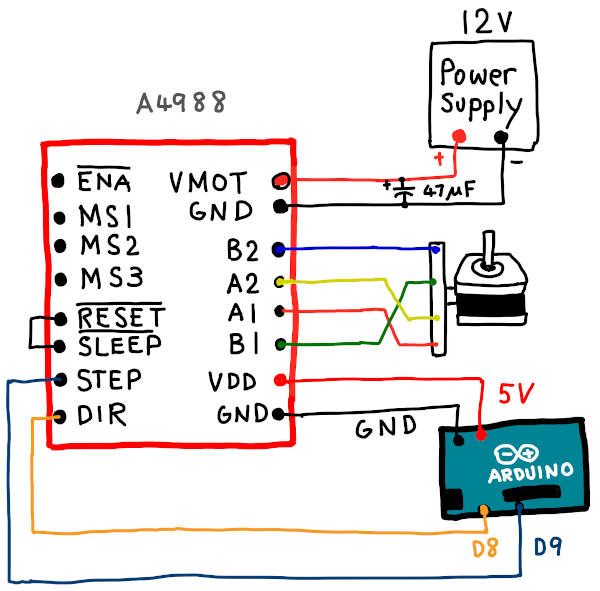

# StepperMotor_A4988

## Overview
StepperDriverライブラリと, ステッピングモータードライバモジュールA4988を用いた, バイポーラ型ステッピングモーターの制御

## Description
【Hardware】  
ステッピングモータードライバモジュールとは, モーターを回す上で必要な電流を外部から供給するIC（供給を仲介。マイコンの不足分を補う）  
A4988はその一種  
 
想定するステッピングモーターの主な仕様  
◇バイポーラタイプ  
◇相数： 2  
◇一回転ステップ角： 200  
[例えばこんなもの](https://akizukidenshi.com/catalog/g/gP-05372/)  
 
制御用のマイコンはArduino（ココでは, Arduino Uno R3）を想定  
但しココでは, Arduino IDEのインストール方法については扱わない

## Installation
### StepperDriverライブラリのインストール方法（for Mac）  
デフォルトで入っているライブラリではないので, まずはインストールする  
  1. 画面上部, 「スケッチメニュー」から「ライブラリをインクルード」を選択  
  2. 「ライブラリを管理...」から表示された画面上の検索窓で「A4988」と入力  
  3. 「StepperDriver」と表示されているライブラリをインストール  
  
### Include Library
  上記でインストールは完了したので, 次はライブラリをコードとしてインクルードする
  1. 画面上部, 「スケッチメニュー」から「ライブラリをインクルード」を選択  
  2. 「StepperDriver」というのがあるので選択  
  以上でStepperDriverライブラリの導入は完了

## Circuit
  
注意点  
  ・外部電源の電圧は9V以上でなければ動かない

